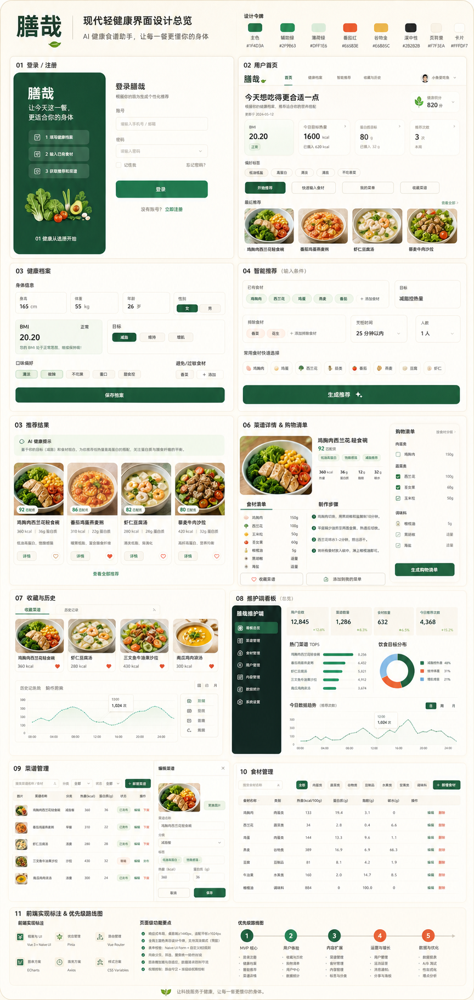

# 膳哉前端界面设计交接文档

本文档给前端开发同学使用，用于统一「膳哉」前端的视觉风格、页面范围、组件拆分、状态处理和验收标准。

当前用户端主风格以 `/user/home` 已实现的首页为准：白色产品顶栏、浅绿横幅、右侧菜谱推荐卡、四个健康指标卡、三块快速入口和四张最近推荐卡。后续用户端页面优化应优先贴近这套风格。

整合设计稿用于页面结构和模块范围参考，不再作为颜色、布局和质感的唯一主参考：



辅助结构参考：

- 设计主图：`docs/ui/shanzai-modern-light-imagegen-board.png`
- 早期结构图：`docs/ui/shanzai-ui-design-board.svg`

## 1. 产品气质

膳哉不是普通后台系统，也不是纯聊天式 AI 工具。它应该像一个“现代轻健康饮食产品”：用户打开后能快速完成“填写健康档案 -> 输入已有食材 -> 获取推荐 -> 查看菜谱 -> 生成购物清单”的闭环；维护员能高效维护菜谱库和食材营养数据。

设计关键词：

- 现代轻健康：奶油白背景、清爽绿色、真实菜谱图片。
- 产品感：用户端要像健康餐 App，而不是表单后台。
- 可信感：推荐结果必须解释清楚热量、蛋白质、匹配度和推荐理由。
- 工具感：维护端保持高密度表格、筛选和编辑抽屉，不做过度装饰。
- 克制高级：参考 Starbucks 的设计系统方法，使用多层品牌色和稳定组件规则，但不复制其品牌元素。

## 2. 视觉系统

建议在 `frontend/src/styles/theme.css` 中定义全局变量：

```css
:root {
  --sz-bg: #f7f3ea;
  --sz-surface: #fffdf7;
  --sz-surface-soft: #faf7ef;
  --sz-line: #e3dacb;
  --sz-ink: #1f2a24;
  --sz-text: #465149;
  --sz-muted: #69766d;
  --sz-deep-green: #1f4d3a;
  --sz-green: #2f9e63;
  --sz-mint: #dff1e6;
  --sz-tomato: #e65b3e;
  --sz-tomato-soft: #f8ded5;
  --sz-grain: #e6b85c;
  --sz-grain-soft: #f4e7c8;
  --sz-blue-soft: #dcecf1;
  --sz-radius-card: 16px;
  --sz-radius-panel: 24px;
  --sz-radius-pill: 999px;
}
```

颜色角色：

| 颜色 | 用途 |
|---|---|
| 奶油白 `#F7F3EA` | 页面底色，替代冷白背景 |
| 米白 `#FFFDF7` | 卡片、表单、弹窗主表面 |
| 深叶绿 `#1F4D3A` | 品牌、维护端侧栏、深色功能区 |
| 鲜蔬绿 `#2F9E63` | 主按钮、核心 CTA、成功状态 |
| 薄荷绿 `#DFF1E6` | 健康状态、标签、轻量提示块 |
| 番茄红 `#E65B3E` | 风险提示、重点强调，不大面积使用 |
| 谷物黄 `#E6B85C` | 热量、能量、营养相关徽章 |
| 浅蓝绿 `#DCECF1` | AI 提示、辅助信息块 |

## 3. 组件规则

### 3.1 按钮

- 主按钮：鲜蔬绿背景、白字、胶囊圆角。
- 次按钮：透明或米白背景、鲜蔬绿描边。
- 深色区域按钮：白底绿字。
- 点击态：`transform: scale(0.96)`，`transition: 0.18s ease`。
- 常用高度：`40px` 到 `48px`。

### 3.2 卡片和面板

- 普通卡片圆角：`16px`。
- 页面级面板圆角：`24px`。
- 阴影使用低透明度多层阴影，不使用厚重投影：

```css
box-shadow:
  0 18px 34px rgba(31, 42, 36, 0.10),
  0 1px 2px rgba(31, 42, 36, 0.08);
```

### 3.3 标签和营养徽章

- 食材标签用薄荷绿。
- 忌口/风险标签用浅番茄红。
- 热量和能量标签用浅谷物黄。
- AI 提示块用浅蓝绿。

### 3.4 图片

用户端必须使用真实或拟真的菜谱图片，尤其是：

- 推荐结果菜谱卡。
- 菜谱详情大图。
- 收藏/历史中的菜谱缩略图。

图片风格要求：

- 明亮自然光。
- 干净餐桌。
- 健康轻食、家常菜都可以，但不能暗黑、油腻、商业水印。
- 卡片图片保持固定比例，推荐 `4:3` 或 `16:10`。

## 4. 路由与页面范围

| 路由 | 页面 | 角色 | 实现优先级 |
|---|---|---|---|
| `/login` | 登录页 | 公开 | P0 |
| `/register` | 注册页 | 公开 | P0 |
| `/user/home` | 用户首页 | USER | P0 |
| `/user/profile` | 健康档案 | USER | P0 |
| `/user/recommend` | 智能推荐 | USER | P0 |
| `/user/recommend/result` | 推荐结果 | USER | P0 |
| `/user/recipes/:id` | 菜谱详情 | USER | P0 |
| `/user/shopping-lists` | 购物清单 | USER | P0 |
| `/user/favorites` | 收藏菜谱 | USER | P1 |
| `/user/history` | 推荐历史 | USER | P1 |
| `/admin/dashboard` | 维护端看板 | MAINTAINER | P0 |
| `/admin/recipes` | 菜谱管理 | MAINTAINER | P0 |
| `/admin/ingredients` | 食材管理 | MAINTAINER | P0 |

## 5. 页面设计要求

### 5.1 登录/注册页

目标：让用户第一眼知道这是健康饮食产品，而不是后台登录页。

结构：

- `/login` 和 `/register` 是独立页面，不在同一个表单中做模式切换。
- 两页共用认证视觉外壳：左侧品牌面板显示「膳哉」、一句话价值主张和三步流程。
- 登录页右侧表单：账号、密码、登录按钮、创建账号入口。
- 登录页底部演示账号：`user1 / 123456`、`maintainer / 123456`。
- 注册页右侧表单：昵称、账号、密码、确认密码、返回登录入口。
- 登录页和注册页表单卡片宽度、高度、圆角、阴影和内边距保持同一规格，避免一个页面“卡片大”、另一个页面“卡片小”的突兀感。

交互：

- 登录成功后根据角色跳转。
- `USER` -> `/user/home`。
- `MAINTAINER` -> `/admin/dashboard`。
- 登录失败在表单上方显示浅番茄红错误提示。
- 注册失败在表单上方显示浅番茄红错误提示，两次密码不一致由前端直接拦截。

### 5.2 用户首页

目标：作为“今天吃什么”的决策入口。

视觉基准：

- 顶栏使用白色产品导航，不做深色侧栏或悬浮玻璃导航。
- 首屏使用浅绿大横幅，左侧主文案和 CTA，右侧展示今日推荐菜谱卡。
- 页面主体使用奶油白背景、米白卡片、浅描边和低透明阴影。
- 主按钮使用深叶绿，辅助按钮使用白底绿字，不使用大面积深绿英雄区。
- 菜谱卡图片占卡片上半区，收藏按钮悬浮在图片右上角，匹配度标签放在图片左下角。
- 不增加浮动快捷按钮，避免压住菜谱图片和移动端内容。

内容：

- 顶部导航：首页、健康档案、智能推荐、购物清单、收藏与历史。
- 欢迎语：`今天想吃得更合适一点`。
- 健康摘要：BMI、每日目标热量、今日目标、推荐次数。
- 主 CTA：`开始推荐`。
- 次 CTA：`快速输入食材`、`我的菜单`、`收藏菜谱`。
- 最近推荐：3 到 4 张菜谱卡片。

空状态：

- 没有健康档案时，优先提示完善档案。
- 没有历史时，展示生成第一份推荐的入口。

### 5.3 健康档案页

目标：让档案填写像轻问卷，而不是体检系统。

字段：

- 身高、体重、年龄、性别。
- 饮食目标：减脂控热量、日常健康、健身增肌。
- 口味偏好。
- 忌口食材。
- 过敏食材。

反馈：

- 保存后展示 BMI 数值和状态。
- 展示每日目标热量。
- 表单保存中要有 loading 状态。

### 5.4 智能推荐页

目标：降低输入成本，像配餐问卷。

输入项：

- 已有食材：标签输入。
- 排除食材：标签输入。
- 目标：默认读取档案，也允许本次覆盖。
- 烹饪时间：15 / 25 / 40 / 60 分钟。
- 人数：1 到 4 人。
- 常用食材快捷选项：鸡胸肉、番茄、牛肉、藜麦、鸡蛋、豆腐等。

提交：

- 主按钮：`生成推荐`。
- loading 文案：`正在匹配菜谱、营养目标和已有食材`。

### 5.5 推荐结果页

目标：让推荐可信、可解释。

内容：

- AI 健康提示。
- 推荐菜谱卡片列表。
- 每张卡片展示：图片、菜名、评分、热量、蛋白质、标签、推荐理由。
- 操作：查看详情、收藏、生成购物清单。

排序：

- 综合评分最高的菜谱置顶。
- 需要展示“已有食材命中”和“还需补买”。

### 5.6 菜谱详情与购物清单

菜谱详情：

- 大图。
- 标题、烹饪时间、适合目标。
- 热量、蛋白质、脂肪、碳水。
- 食材清单。
- 做法步骤。
- 收藏按钮。
- 生成购物清单按钮。

购物清单：

- 按分类分组。
- 已有食材不进入待买列表。
- 支持勾选已购买。

### 5.7 收藏与历史

收藏页：

- 复用 `RecipeCard`。
- 支持取消收藏。

历史页：

- 展示推荐输入快照。
- 展示推荐结果缩略卡。
- 支持点击进入菜谱详情。

### 5.8 维护端看板

目标：高效展示系统数据，不做复杂管理平台。

内容：

- 用户数量。
- 菜谱数量。
- 食材数量。
- 推荐次数。
- 热门菜谱排行。
- 饮食目标分布。
- 最近推荐趋势。

维护端视觉：

- 左侧深叶绿侧栏。
- 内容区米白背景。
- 表格密度比用户端更高。
- 统计图可用轻量 CSS 或 ECharts；第一版不强制引入复杂图表库。

### 5.9 菜谱管理和食材管理

菜谱管理：

- 搜索：菜名、分类、目标。
- 列：图片、菜名、分类、热量、蛋白质、状态、操作。
- 操作：新增、编辑、下架。
- 编辑建议使用右侧抽屉。

食材管理：

- 搜索：名称、分类。
- 分类筛选：全部、肉蛋奶、蔬菜、主食、调味料、其他。
- 列：名称、分类、热量、蛋白质、脂肪、碳水、操作。

## 6. 组件拆分建议

| 组件 | 路径建议 | 说明 |
|---|---|---|
| `UserLayout.vue` | `frontend/src/layouts/UserLayout.vue` | 用户端顶部导航和内容容器 |
| `AdminLayout.vue` | `frontend/src/layouts/AdminLayout.vue` | 维护端侧边栏和顶部工具条 |
| `RecipeCard.vue` | `frontend/src/components/RecipeCard.vue` | 首页、推荐结果、收藏复用 |
| `NutritionBar.vue` | `frontend/src/components/NutritionBar.vue` | 热量、蛋白质、脂肪、碳水展示 |
| `IngredientTagInput.vue` | `frontend/src/components/IngredientTagInput.vue` | 食材输入、忌口、过敏食材复用 |
| `GoalSegment.vue` | `frontend/src/components/GoalSegment.vue` | 三种饮食目标切换 |
| `HealthSummaryCard.vue` | `frontend/src/components/HealthSummaryCard.vue` | BMI、热量、目标摘要 |
| `RecipeEditorDrawer.vue` | `frontend/src/components/RecipeEditorDrawer.vue` | 菜谱新增和编辑 |
| `IngredientEditorDrawer.vue` | `frontend/src/components/IngredientEditorDrawer.vue` | 食材新增和编辑 |

Naive UI 对应组件：

- 表单：`n-form`, `n-form-item`, `n-input`, `n-input-number`, `n-select`, `n-dynamic-tags`
- 标签：`n-tag`
- 表格：`n-data-table`
- 抽屉：`n-drawer`
- 弹窗确认：`n-popconfirm`
- 反馈：`n-message`, `n-spin`, `n-empty`

## 7. API 对接顺序

前端可以先用 mock 数据完成页面，再逐步替换为真实接口。

建议顺序：

1. 登录和角色跳转：`POST /api/auth/login`, `GET /api/auth/me`
2. 健康档案：首页和档案页：`GET /api/profile`, `PUT /api/profile`, `GET /api/profile/summary`
3. 菜谱基础：`GET /api/recipes`, `GET /api/recipes/{id}`
4. 推荐：`POST /api/recommendations`, `GET /api/recommendations/history`
5. 收藏与购物清单：`GET /api/favorites`, `POST /api/shopping-lists`
6. 维护端：`/api/admin/**`

## 8. 状态处理

每个页面至少实现：

- loading：按钮 loading 或页面 `n-spin`
- empty：说明为什么为空，并给下一步按钮
- error：展示错误消息，不清空用户已填内容
- success：保存、收藏、生成购物清单成功提示

HTTP 状态：

- 401：清空 token，跳转 `/login`，提示登录过期。
- 403：展示无权限提示，普通用户不能进入维护端。
- 500：提示系统异常，保留当前页面。

## 9. 前端实现优先级

第一批 P0：

1. 登录页、注册页和路由守卫
2. 用户首页
3. 健康档案页
4. 智能推荐输入页
5. 推荐结果页
6. 菜谱详情页
7. 购物清单页
8. 维护端看板
9. 菜谱管理
10. 食材管理

第二批 P1：

- 收藏页
- 推荐历史页
- 移动端细节
- 图片替换和视觉 polish

## 10. 和前端同学怎么对接

你可以把这几个文件发给前端同学：

1. `docs/frontend-ui-design.md`：正式设计和页面规范。
2. `docs/ui/shanzai-modern-light-imagegen-board.png`：主视觉设计稿。
3. `docs/superpowers/specs/2026-07-06-smart-recipe-assistant-design.md`：产品需求和完整业务说明。
4. `docs/git-workflow.md`：协作分支和提交规范。

建议对接方式：

1. 先让前端同学只看设计稿和本文件，不急着写所有页面。
2. 让他先完成 `frontend` 脚手架、路由、主题变量、`UserLayout`、`AdminLayout`。
3. 第一批只实现登录页、用户首页、健康档案页、智能推荐页四个页面，可用 mock 数据。
4. 每完成一批页面，发截图对照 `shanzai-modern-light-imagegen-board.png` 检查视觉。
5. 等后端接口完成后，再把 mock 数据替换为真实接口。

建议分支：

- 前端同学从 `main` 拉取最新代码。
- 新建分支：`feature/frontend-ui`。
- 提交信息使用中文，例如：`feat: 搭建前端基础布局和主题变量`。

建议你发给他的简短说明：

```text
你先从 main 拉最新代码，新建 feature/frontend-ui 分支。
前端先按 docs/frontend-ui-design.md 和 docs/ui/shanzai-modern-light-imagegen-board.png 做页面，不用等后端接口全部完成，可以先用 mock 数据。
第一批优先做：登录页、用户首页、健康档案页、智能推荐页，以及 UserLayout/AdminLayout 和主题变量。
颜色、按钮、圆角、卡片、状态处理都按文档统一，不要临时换风格。
做完第一批先发截图，我们对照设计稿确认后再继续推荐结果、详情、购物清单和维护端页面。
```

## 11. 验收清单

每个页面完成后检查：

- 是否符合对应路由和角色权限。
- 是否使用统一 CSS 变量。
- 是否有 loading、empty、error、success 状态。
- 375px 手机宽度下文字和按钮不溢出。
- 菜谱卡片是否有图片、热量、蛋白质和操作按钮。
- 健康档案是否能展示 BMI 和目标热量。
- 推荐结果是否能说明推荐理由。
- 购物清单是否能按分类勾选。
- 维护端是否有搜索、筛选、编辑入口。

