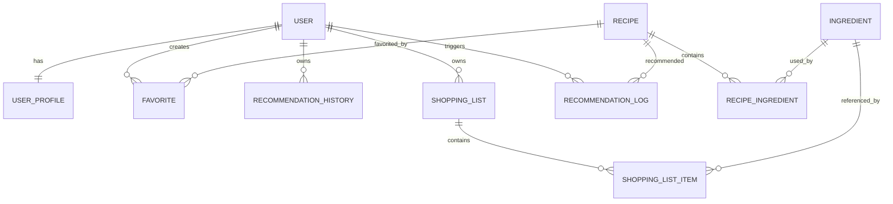
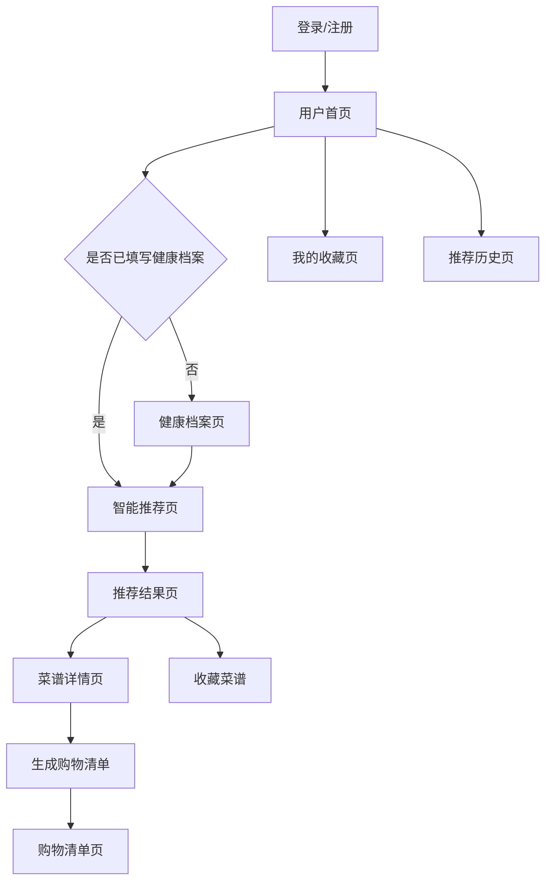
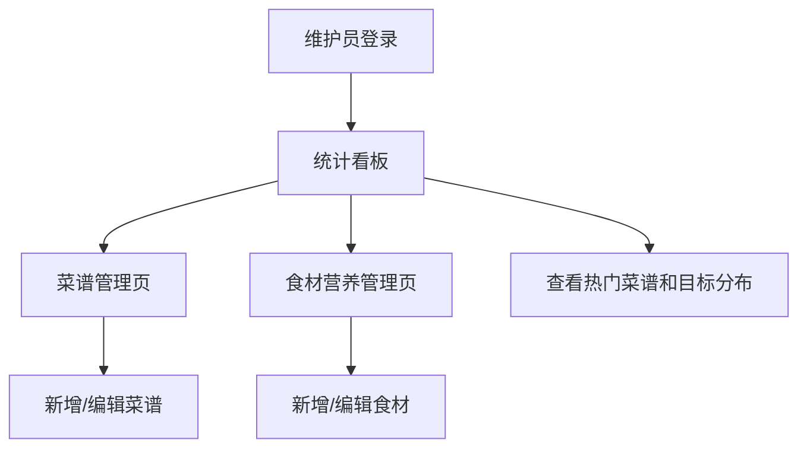
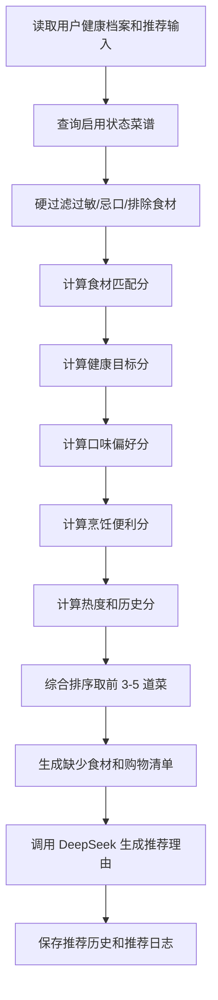

# 膳哉：智能健康菜谱助手产品设计记忆文档

## 1. 文档目的

本文档用于记录短学期项目“智能菜谱助手”的产品设计决策，作为后续 AI 辅助开发、报告撰写、视频演示和团队协作的长期记忆来源。

后续继续设计或实现时，优先以本文档为准；如有新决策，应更新本文档，避免需求漂移或重复讨论。

## 2. 项目背景与课程约束

课程选题来自“短学期任务与要求.pdf”中的题目 18：智能菜谱助手，属于创意娱乐类，原始要求为“根据食材、口味推荐菜谱，生成购物清单等”。

课程交付要求包括：

- 一个可运行的软件作品。
- 一份实验报告，内容包括实验目的、成员分工、需求分析、数据库设计、技术选型、系统结构图、界面说明、关键代码和实验总结。
- 一个不超过 5 分钟的 MP4 演示视频，需要展示作品、代码和解说。
- 代码和数据库 SQL 脚本需要压缩提交。
- 截止时间为 2026-07-14 24:00。

团队情况：

- 小组 2 人。
- 两人都会使用 AI 辅助开发。
- 目标不是只做简单 Demo，而是尽量按软件工程流程设计，争取高分。

## 3. 已确认的核心方向

项目名称确定：

**膳哉：基于健康档案的智能菜谱推荐与购物清单生成系统**

命名说明：

- 「膳」直接关联健康饮食、膳食搭配和菜谱推荐。
- 「哉」带一点轻松、有辨识度的语气，让名字不像普通课程 Demo。
- 界面、Logo 和口头演示使用短名称「膳哉」。
- 实验报告、系统说明和答辩标题使用正式名称「膳哉：基于健康档案的智能菜谱推荐与购物清单生成系统」。

项目定位：

本系统不是普通菜谱搜索工具，也不是单纯的 AI 聊天问答工具，而是一个完整的 Web 应用。用户登录后填写健康档案、饮食目标、口味偏好和已有食材，系统结合菜谱库、食材营养数据、规则推荐和 AI 生成能力，推荐适合的菜谱，展示营养参考，并生成购物清单。

核心产品价值：

- 帮助用户解决“今天吃什么”的决策问题。
- 根据健康目标推荐更合适的菜谱。
- 根据已有食材减少浪费，并自动补齐购物清单。
- 提供热量、蛋白质、脂肪、碳水等营养参考。
- 通过数据维护端保证菜谱和营养数据可维护，而不是写死在代码中。

## 4. 竞品参考结论

为避免闭门造车，本项目参考以下几类市场产品的设计思路：

- Mealime：强调从餐食计划到购物清单再到烹饪步骤的流程，适合参考“推荐菜谱 -> 生成购物清单 -> 跟随步骤做饭”的主流程。
- Paprika：强调菜谱收藏、菜谱管理、购物清单和烹饪模式，适合参考“菜谱详情、收藏、食材清单”的组织方式。
- MyFitnessPal / FatSecret：强调食物数据库、热量追踪和宏量营养素，适合参考“健康目标、热量、蛋白质、脂肪、碳水”的数据表达。
- Samsung Food：强调基于现有食材、个性化偏好和 AI 能力推荐菜谱，适合参考“已有食材 + 个性化推荐 + 购物清单”的方向。

本项目不直接复制竞品，而是提取适合短学期项目的主流程：

**建档案 -> 选目标 -> 填食材 -> 推荐菜谱 -> 看营养 -> 生成购物清单 -> 收藏/记录**

参考链接：

- Mealime: https://www.mealime.com/
- Paprika: https://www.paprikaapp.com/
- MyFitnessPal: https://www.myfitnesspal.com/
- FatSecret: https://www.fatsecret.com/
- Samsung Food: https://www.samsungfood.com/

## 5. 目标用户与使用场景

系统覆盖三类用户场景，但不拆成三套系统，而是通过“饮食目标”统一建模。

### 5.1 减脂控热量用户

典型用户：

- 大学生。
- 久坐学习、希望控制体重的人。
- 想吃得健康但没有系统饮食知识的人。

需求：

- 推荐低热量、少油、饱腹感强的菜谱。
- 关注总热量和碳水比例。
- 希望做法简单，食材容易购买。

### 5.2 日常健康用户

典型用户：

- 普通家庭用户。
- 不知道每天吃什么的人。
- 希望利用冰箱里已有食材的人。

需求：

- 根据已有食材快速推荐家常菜。
- 菜谱要均衡、易做、时间可控。
- 自动生成缺少食材的购物清单。

### 5.3 健身增肌用户

典型用户：

- 有健身习惯的人。
- 希望提高蛋白质摄入的人。
- 训练后需要高蛋白饮食搭配的人。

需求：

- 推荐高蛋白、碳水适中、脂肪不过高的菜谱。
- 展示蛋白质含量和营养结构。
- 推荐理由要说明为什么适合增肌或训练后食用。

## 6. 角色设计

系统设计两个角色。

### 6.1 普通用户

普通用户是系统的主要使用者，负责填写健康档案、输入食材、获取推荐、查看菜谱、生成购物清单、收藏菜谱和查看历史记录。

普通用户关注的是“我适合吃什么、怎么做、还要买什么”。

### 6.2 数据维护员

数据维护员不是传统意义上的后台管理员，也不是论坛类系统中的审核员。其主要职责是维护系统的菜谱知识库和食材营养数据。

数据维护员负责：

- 维护菜谱库。
- 维护食材营养库。
- 查看系统推荐统计。

引入数据维护端的原因：

- 避免所有菜谱和营养数据写死在代码中。
- 支撑规则推荐和 AI 兜底逻辑。
- 提升系统完整性，便于报告中体现角色划分、权限控制、数据库设计和管理模块。

边界控制：

- 不做复杂用户封禁。
- 不做内容审核流程。
- 不做完整权限管理系统。
- 最多保留用户数量统计，不做复杂用户管理。

## 7. 功能模块设计

### 7.1 用户模块

功能：

- 用户注册。
- 用户登录。
- 用户退出。
- 修改基础个人信息。
- 根据角色进入普通用户端或数据维护端。

说明：

登录功能可以提升系统完整度，也便于保存健康档案、收藏和历史记录。

### 7.2 健康档案模块

功能：

- 维护年龄、性别、身高、体重。
- 选择饮食目标：减脂控热量、日常健康、健身增肌。
- 设置口味偏好：清淡、家常、川味、低脂、高蛋白等。
- 设置忌口和过敏食材。

可选增强：

- 根据身高体重计算 BMI。
- 给出简单健康提示。

边界：

- 不做医学诊断。
- 不承诺精准减肥或治疗效果。
- 所有营养建议仅作为健康饮食参考。

### 7.3 食材输入模块

功能：

- 输入已有食材。
- 输入不想使用的食材。
- 设置烹饪时间。
- 设置用餐人数。

说明：

这是推荐流程的入口。用户可以表达“我现在有什么”和“我不想吃什么”。

### 7.4 智能推荐模块

功能：

- 根据健康档案、饮食目标、已有食材、口味偏好和忌口信息推荐 3-5 道菜谱。
- 对每道菜给出匹配理由。
- 展示适合目标，例如低卡、高蛋白、营养均衡。

推荐策略：

- 数据库规则推荐作为基础能力。
- AI 能力用于生成推荐理由、健康建议和更自然的菜谱说明。
- 当 AI 接口不可用时，系统仍能基于数据库菜谱完成推荐。

推荐排序可考虑：

- 食材匹配度。
- 饮食目标匹配度。
- 忌口和过敏过滤。
- 烹饪时间匹配。
- 热量或蛋白质指标。

### 7.5 菜谱详情模块

功能：

- 展示菜名、简介、图片或占位图。
- 展示所需食材和用量。
- 展示制作步骤。
- 展示预计热量、蛋白质、脂肪、碳水。
- 展示健康标签，如低卡、高蛋白、低脂、家常、快手。
- 展示 AI 推荐理由。

### 7.6 购物清单模块

功能：

- 根据用户选择的菜谱和已有食材，计算缺少食材。
- 按分类展示购物清单：蔬菜、肉蛋奶、主食、调料、其他。
- 支持勾选已购买食材。

说明：

购物清单是本题原始要求之一，必须作为核心功能保留。

### 7.7 收藏与历史模块

功能：

- 收藏喜欢的菜谱。
- 查看收藏列表。
- 查看历史推荐记录。
- 从历史记录重新查看推荐结果。

说明：

该模块依赖用户登录，是体现系统不是一次性 Demo 的重要功能。

### 7.8 菜谱数据维护模块

角色：

- 数据维护员。

功能：

- 新增菜谱。
- 修改菜谱。
- 删除菜谱。
- 查询菜谱。
- 维护菜谱标签、适合目标、烹饪时间和营养摘要。

### 7.9 食材营养维护模块

角色：

- 数据维护员。

功能：

- 新增食材。
- 修改食材。
- 删除食材。
- 查询食材。
- 维护食材分类、单位、每 100g 热量、蛋白质、脂肪、碳水。

### 7.10 统计看板模块

角色：

- 数据维护员。

功能：

- 查看用户数量。
- 查看推荐次数。
- 查看热门菜谱。
- 查看常见饮食目标分布。

说明：

统计看板只做轻量展示，不做复杂数据分析平台。

## 8. 核心业务流程

### 8.1 普通用户推荐流程

1. 用户注册并登录。
2. 用户填写或修改健康档案。
3. 用户输入已有食材、忌口和烹饪条件。
4. 系统过滤不符合忌口和过敏要求的菜谱。
5. 系统根据食材匹配度、健康目标和营养标签推荐菜谱。
6. 系统调用 AI 生成推荐理由和饮食建议。
7. 用户查看菜谱详情。
8. 用户生成购物清单。
9. 用户收藏菜谱或保存推荐历史。

### 8.2 数据维护流程

1. 数据维护员登录。
2. 进入数据维护端。
3. 维护菜谱、食材和营养信息。
4. 查看推荐统计。
5. 更新后的数据参与用户推荐流程。

## 9. 数据库 E-R 设计

数据库设计围绕“用户建档案 -> 输入食材 -> 推荐菜谱 -> 生成购物清单 -> 收藏和记录历史”这一核心闭环展开。

### 9.1 实体关系概览



### 9.2 用户表 user

用途：

- 存储普通用户和数据维护员账号。
- 支撑登录、角色判断和基础用户信息展示。

建议字段：

| 字段 | 类型 | 说明 |
|---|---|---|
| id | bigint | 主键 |
| username | varchar(50) | 登录账号，唯一 |
| password_hash | varchar(255) | 密码哈希 |
| nickname | varchar(50) | 用户昵称 |
| role | varchar(20) | USER 普通用户，MAINTAINER 数据维护员 |
| status | tinyint | 1 正常，0 禁用 |
| created_at | datetime | 创建时间 |
| updated_at | datetime | 更新时间 |

设计说明：

- 本项目不做复杂权限系统，一个 role 字段足够。
- 不建议明文保存密码，至少在设计和报告中写为 password_hash。

### 9.3 健康档案表 user_profile

用途：

- 保存用户的身体基础信息、饮食目标、口味偏好和忌口信息。
- 为推荐算法提供个性化依据。

建议字段：

| 字段 | 类型 | 说明 |
|---|---|---|
| id | bigint | 主键 |
| user_id | bigint | 关联 user.id，唯一 |
| gender | varchar(10) | 性别 |
| age | int | 年龄 |
| height_cm | decimal(5,2) | 身高，厘米 |
| weight_kg | decimal(5,2) | 体重，千克 |
| bmi | decimal(5,2) | BMI，可由身高体重计算 |
| diet_goal | varchar(30) | FAT_LOSS 减脂，BALANCED 日常健康，MUSCLE_GAIN 增肌 |
| taste_preferences | varchar(255) | 口味偏好，逗号分隔或 JSON |
| avoid_ingredients | varchar(255) | 忌口食材 |
| allergy_ingredients | varchar(255) | 过敏食材 |
| cooking_time_preference | int | 期望烹饪时间，分钟 |
| daily_calorie_target | int | 建议每日热量，可选 |
| updated_at | datetime | 更新时间 |

设计说明：

- 第一版可用字符串保存偏好和忌口，降低建表复杂度。
- 如果后期时间充足，再拆成偏好关联表。

### 9.4 菜谱表 recipe

用途：

- 存储菜谱基础信息、营养摘要、健康标签和烹饪步骤。
- 普通用户推荐和维护端管理都围绕该表展开。

建议字段：

| 字段 | 类型 | 说明 |
|---|---|---|
| id | bigint | 主键 |
| name | varchar(100) | 菜谱名称 |
| description | varchar(500) | 菜谱简介 |
| image_url | varchar(255) | 菜谱图片，可为空 |
| cooking_time | int | 烹饪时间，分钟 |
| difficulty | varchar(20) | EASY/MEDIUM/HARD |
| servings | int | 默认份数 |
| calories | int | 每份预计热量 |
| protein | decimal(6,2) | 每份蛋白质，克 |
| fat | decimal(6,2) | 每份脂肪，克 |
| carbs | decimal(6,2) | 每份碳水，克 |
| taste_tags | varchar(255) | 口味标签，如清淡、家常、川味 |
| health_tags | varchar(255) | 健康标签，如低卡、高蛋白、低脂 |
| target_goals | varchar(255) | 适合目标，如 FAT_LOSS,MUSCLE_GAIN |
| steps | text | 烹饪步骤 |
| status | tinyint | 1 启用，0 下架 |
| created_by | bigint | 创建人，可关联 user.id |
| created_at | datetime | 创建时间 |
| updated_at | datetime | 更新时间 |

设计说明：

- 热量和营养数据先保存为“每份估算值”，便于展示和推荐排序。
- target_goals 可支持一道菜适配多个目标。

### 9.5 食材表 ingredient

用途：

- 存储食材分类和基础营养数据。
- 支撑菜谱组成、购物清单分类和营养估算。

建议字段：

| 字段 | 类型 | 说明 |
|---|---|---|
| id | bigint | 主键 |
| name | varchar(100) | 食材名称 |
| category | varchar(50) | 分类：蔬菜、肉蛋奶、主食、调料、其他 |
| unit | varchar(20) | 默认单位，如 g、个、勺 |
| calories_per_100g | int | 每 100g 热量 |
| protein_per_100g | decimal(6,2) | 每 100g 蛋白质 |
| fat_per_100g | decimal(6,2) | 每 100g 脂肪 |
| carbs_per_100g | decimal(6,2) | 每 100g 碳水 |
| aliases | varchar(255) | 别名，如 西红柿/番茄 |
| created_at | datetime | 创建时间 |
| updated_at | datetime | 更新时间 |

设计说明：

- aliases 用于解决用户输入“西红柿”而菜谱中写“番茄”的匹配问题。
- 营养数据为参考值，不做医学级准确承诺。

### 9.6 菜谱食材关联表 recipe_ingredient

用途：

- 表示一道菜谱需要哪些食材以及用量。

建议字段：

| 字段 | 类型 | 说明 |
|---|---|---|
| id | bigint | 主键 |
| recipe_id | bigint | 关联 recipe.id |
| ingredient_id | bigint | 关联 ingredient.id |
| quantity | decimal(8,2) | 用量 |
| unit | varchar(20) | 单位 |
| is_core | tinyint | 是否核心食材 |

设计说明：

- 推荐时优先匹配核心食材。
- 购物清单根据该表和用户已有食材计算缺少项。

### 9.7 收藏表 favorite

用途：

- 保存用户收藏的菜谱。

建议字段：

| 字段 | 类型 | 说明 |
|---|---|---|
| id | bigint | 主键 |
| user_id | bigint | 关联 user.id |
| recipe_id | bigint | 关联 recipe.id |
| created_at | datetime | 收藏时间 |

约束：

- user_id + recipe_id 建议唯一，避免重复收藏。

### 9.8 推荐历史表 recommendation_history

用途：

- 保存一次推荐请求和推荐结果，便于用户查看历史，也便于报告展示系统闭环。

建议字段：

| 字段 | 类型 | 说明 |
|---|---|---|
| id | bigint | 主键 |
| user_id | bigint | 关联 user.id |
| input_ingredients | text | 用户输入的已有食材 |
| excluded_ingredients | text | 用户排除的食材 |
| diet_goal | varchar(30) | 本次推荐目标 |
| cooking_time | int | 本次期望烹饪时间 |
| servings | int | 用餐人数 |
| result_recipe_ids | varchar(255) | 推荐结果菜谱 ID 列表 |
| ai_summary | text | AI 生成的整体建议 |
| created_at | datetime | 推荐时间 |

设计说明：

- result_recipe_ids 第一版可用逗号分隔保存，降低实现成本。
- 如果后期需要更规范，可拆推荐结果明细表。

### 9.9 购物清单表 shopping_list

用途：

- 保存用户基于某次推荐或某个菜谱生成的购物清单。

建议字段：

| 字段 | 类型 | 说明 |
|---|---|---|
| id | bigint | 主键 |
| user_id | bigint | 关联 user.id |
| title | varchar(100) | 清单标题 |
| source_recipe_ids | varchar(255) | 来源菜谱 ID 列表 |
| status | varchar(20) | ACTIVE/FINISHED |
| created_at | datetime | 创建时间 |
| updated_at | datetime | 更新时间 |

### 9.10 购物清单明细表 shopping_list_item

用途：

- 保存购物清单中的具体食材项。

建议字段：

| 字段 | 类型 | 说明 |
|---|---|---|
| id | bigint | 主键 |
| shopping_list_id | bigint | 关联 shopping_list.id |
| ingredient_id | bigint | 可关联 ingredient.id |
| ingredient_name | varchar(100) | 食材名称冗余，便于展示 |
| category | varchar(50) | 食材分类 |
| quantity | decimal(8,2) | 数量 |
| unit | varchar(20) | 单位 |
| checked | tinyint | 是否已购买 |

设计说明：

- ingredient_name 做冗余，避免食材表修改后历史清单展示异常。

### 9.11 推荐日志表 recommendation_log

用途：

- 保存推荐打分和统计数据，支撑维护端统计看板。

建议字段：

| 字段 | 类型 | 说明 |
|---|---|---|
| id | bigint | 主键 |
| user_id | bigint | 关联 user.id |
| recipe_id | bigint | 关联 recipe.id |
| diet_goal | varchar(30) | 推荐目标 |
| score | decimal(8,2) | 推荐分数 |
| input_snapshot | text | 输入快照 |
| created_at | datetime | 创建时间 |

设计说明：

- 统计热门菜谱时，可按 recipe_id 出现次数排序。
- 统计常见目标时，可按 diet_goal 分组。

## 10. 页面流程与导航设计

页面设计遵循“先完成用户核心闭环，再补充维护端”的原则。

### 10.1 普通用户端页面

建议页面：

1. 登录/注册页
2. 用户首页
3. 健康档案页
4. 智能推荐页
5. 推荐结果页
6. 菜谱详情页
7. 购物清单页
8. 我的收藏页
9. 推荐历史页

普通用户主流程：



页面说明：

- 用户首页：展示欢迎信息、当前饮食目标、快捷入口、最近推荐记录。
- 健康档案页：维护身体信息、目标、偏好、忌口和过敏食材。
- 智能推荐页：输入已有食材、排除食材、用餐人数和烹饪时间。
- 推荐结果页：展示 3-5 个菜谱卡片、匹配分数、热量和推荐理由。
- 菜谱详情页：展示食材、步骤、营养、标签、收藏按钮和生成购物清单按钮。
- 购物清单页：按分类展示缺少食材，支持勾选已购买。
- 我的收藏页：展示收藏菜谱，支持取消收藏和查看详情。
- 推荐历史页：展示每次推荐输入和结果，支持重新查看。

### 10.2 数据维护端页面

建议页面：

1. 维护端登录后首页/统计看板
2. 菜谱管理页
3. 菜谱编辑页
4. 食材营养管理页
5. 食材编辑页

数据维护端主流程：



页面说明：

- 统计看板：展示用户数量、推荐次数、热门菜谱、饮食目标分布。
- 菜谱管理页：查询、新增、修改、删除菜谱。
- 菜谱编辑页：维护菜名、简介、步骤、标签、营养摘要、适合目标和所需食材。
- 食材营养管理页：查询、新增、修改、删除食材营养数据。
- 食材编辑页：维护分类、单位、热量、蛋白质、脂肪、碳水和别名。

### 10.3 页面优先级

第一优先级，必须完成：

- 登录/注册页。
- 健康档案页。
- 智能推荐页。
- 推荐结果页。
- 菜谱详情页。
- 购物清单页。
- 菜谱管理页。
- 食材管理页。

第二优先级，建议完成：

- 用户首页。
- 我的收藏页。
- 推荐历史页。
- 统计看板。

第三优先级，时间充足再优化：

- 更精细的数据图表。
- 菜谱图片上传。
- 推荐结果对比视图。

## 11. 推荐算法规则设计

第一版推荐算法采用“硬过滤 + 加权打分 + AI 解释”的设计。

设计目标：

- 结果可解释，便于报告和演示说明。
- 不完全依赖 DeepSeek API，保证离线数据库规则也能工作。
- 算法足够简单，2 人小组能按时实现。
- 推荐结果能体现健康目标、已有食材、口味偏好和购物清单之间的关系。

### 11.1 推荐输入

推荐接口需要接收以下输入：

| 输入 | 来源 | 说明 |
|---|---|---|
| user_id | 登录态 | 当前用户 |
| diet_goal | 健康档案或推荐页 | FAT_LOSS/BALANCED/MUSCLE_GAIN |
| available_ingredients | 推荐页 | 用户已有食材 |
| excluded_ingredients | 推荐页 | 本次不想使用的食材 |
| allergy_ingredients | 健康档案 | 过敏食材 |
| avoid_ingredients | 健康档案 | 长期忌口 |
| taste_preferences | 健康档案 | 口味偏好 |
| cooking_time | 推荐页 | 期望烹饪时间 |
| servings | 推荐页 | 用餐人数 |

### 11.2 推荐流程



### 11.3 硬过滤规则

硬过滤用于排除明显不适合的菜谱。被过滤的菜谱不进入后续打分。

规则：

- 菜谱 status 必须为 1。
- 菜谱食材不能包含用户 allergy_ingredients 中的过敏食材。
- 菜谱食材不能包含用户 avoid_ingredients 中的长期忌口食材。
- 菜谱食材不能包含本次 excluded_ingredients 中的排除食材。
- 如果用户输入了 cooking_time，第一版允许菜谱 cooking_time 不超过期望时间 + 15 分钟。

说明：

- 过敏和忌口必须硬过滤，不能只扣分。
- 烹饪时间允许 15 分钟缓冲，避免结果过少。
- 食材匹配需要考虑 ingredient.aliases，例如“番茄”和“西红柿”应视为同类。

### 11.4 加权打分规则

推荐总分为 100 分。

| 维度 | 权重 | 说明 |
|---|---:|---|
| 食材匹配分 | 35 | 用户已有食材和菜谱所需食材的匹配程度 |
| 健康目标分 | 25 | 菜谱是否适合减脂、日常健康或增肌 |
| 口味偏好分 | 15 | 菜谱口味标签是否匹配用户偏好 |
| 烹饪便利分 | 15 | 烹饪时间、难度、缺少食材数量 |
| 热度和历史分 | 10 | 收藏、推荐次数、用户历史行为 |

综合公式：

```text
total_score =
  ingredient_score * 0.35 +
  goal_score * 0.25 +
  taste_score * 0.15 +
  convenience_score * 0.15 +
  popularity_score * 0.10
```

每个子分数都按 0-100 计算，再乘以权重。

### 11.5 食材匹配分

食材匹配分关注“用户手里已有食材能不能做这道菜”。

建议公式：

```text
ingredient_score =
  core_match_rate * 70 +
  all_match_rate * 30
```

说明：

- core_match_rate = 已匹配核心食材数 / 菜谱核心食材总数。
- all_match_rate = 已匹配全部食材数 / 菜谱全部食材总数。
- recipe_ingredient.is_core = 1 的食材视为核心食材。
- 如果一道菜核心食材完全不匹配，即使其他调料匹配，也不应排在前面。

示例：

- 用户已有：鸡胸肉、西兰花、鸡蛋。
- 菜谱“鸡胸肉沙拉”核心食材：鸡胸肉、生菜。
- 核心匹配率 1/2，全部匹配率按所有食材继续计算。

### 11.6 健康目标分

健康目标分根据用户 diet_goal 计算。

#### 减脂控热量 FAT_LOSS

加分因素：

- calories 较低。
- health_tags 包含低卡、低脂、清淡。
- fat 不高。

建议规则：

```text
如果 calories <= 400，加 45 分；
如果 400 < calories <= 550，加 35 分；
如果 550 < calories <= 700，加 20 分；
如果 calories > 700，加 5 分；
health_tags 命中低卡/低脂/清淡，每个加 10 分，最高 30 分；
fat <= 15g 加 25 分，否则按比例降低。
```

#### 日常健康 BALANCED

加分因素：

- 热量不过高。
- 蛋白质、脂肪、碳水相对均衡。
- health_tags 包含营养均衡、家常、快手。

建议规则：

```text
calories 在 400-700 之间，加 35 分；
protein >= 15g，加 20 分；
fat <= 25g，加 15 分；
health_tags 命中营养均衡/家常/快手，每个加 10 分，最高 30 分。
```

#### 健身增肌 MUSCLE_GAIN

加分因素：

- protein 较高。
- calories 适中或略高。
- health_tags 包含高蛋白。

建议规则：

```text
protein >= 30g，加 45 分；
20g <= protein < 30g，加 35 分；
15g <= protein < 20g，加 20 分；
protein < 15g，加 5 分；
health_tags 命中高蛋白/增肌，每个加 15 分，最高 30 分；
fat <= 25g 加 25 分，否则按比例降低。
```

实现说明：

- 第一版不需要做特别复杂的营养学公式。
- 目标分只作为推荐排序参考，不作为医学建议。
- 如果 recipe.target_goals 包含当前 diet_goal，可额外加 10 分，但目标分最高仍限制为 100 分。

### 11.7 口味偏好分

口味偏好分用于匹配用户喜欢的菜系或口味。

建议规则：

```text
taste_score = 命中的口味标签数 / 用户口味偏好总数 * 100
```

补充：

- 如果用户未设置口味偏好，taste_score 默认 70 分，避免空偏好导致全部低分。
- 口味标签来自 recipe.taste_tags，例如清淡、家常、川味、酸甜、低脂。
- 用户偏好来自 user_profile.taste_preferences。

### 11.8 烹饪便利分

烹饪便利分用于体现“这道菜是不是容易做”。

建议规则：

| 条件 | 分值 |
|---|---:|
| cooking_time <= 用户期望时间 | 40 |
| cooking_time 在期望时间 + 15 分钟内 | 25 |
| 难度 EASY | 25 |
| 难度 MEDIUM | 15 |
| 难度 HARD | 5 |
| 缺少食材数量 <= 2 | 35 |
| 缺少食材数量 3-4 | 20 |
| 缺少食材数量 > 4 | 5 |

最终：

```text
convenience_score = 时间分 + 难度分 + 缺少食材分
```

最高限制为 100 分。

### 11.9 热度和历史分

热度和历史分用于让系统看起来更完整，但第一版不要做复杂个性化推荐。

建议规则：

- 菜谱被收藏次数越多，分数越高。
- 菜谱被推荐次数越多，分数越高。
- 如果用户历史收藏过相同健康标签的菜谱，可少量加分。

第一版简化：

```text
popularity_score = min(收藏次数 * 5 + 推荐次数 * 2, 100)
```

如果暂时没有统计数据：

- 默认 popularity_score = 50。

### 11.10 推荐结果输出

推荐接口最终返回 3-5 道菜谱。

每个推荐结果包含：

- recipe_id。
- 菜名。
- 图片。
- 总分。
- 热量、蛋白质、脂肪、碳水。
- 命中的已有食材。
- 缺少食材。
- 健康标签。
- AI 推荐理由。

推荐理由格式示例：

```text
推荐理由：这道鸡胸肉沙拉匹配你当前的增肌目标，蛋白质含量较高，
并且你已有鸡胸肉和鸡蛋，只需要补充生菜和玉米即可完成。
```

### 11.11 购物清单生成规则

购物清单根据“菜谱所需食材 - 用户已有食材”计算。

规则：

- 读取用户选择的菜谱对应的 recipe_ingredient。
- 将 available_ingredients 视为已有食材。
- 未匹配到的食材进入 shopping_list_item。
- 按 ingredient.category 分组展示。
- 如果同一食材在多个菜谱中出现，需要合并数量。

示例：

用户已有：

- 鸡胸肉。
- 鸡蛋。

菜谱需要：

- 鸡胸肉 200g。
- 生菜 100g。
- 鸡蛋 1 个。
- 玉米 50g。

购物清单：

- 蔬菜：生菜 100g。
- 主食/杂粮：玉米 50g。

### 11.12 DeepSeek 在推荐中的作用

DeepSeek 不直接决定推荐排序，而是在规则推荐结果出来后生成解释性内容。

输入给 DeepSeek 的内容：

- 用户饮食目标。
- 用户已有食材。
- 推荐菜谱名称。
- 菜谱营养数据。
- 命中食材和缺少食材。
- 推荐总分和主要加分原因。

输出内容：

- 推荐理由。
- 简短健康建议。
- 购物清单提示。

失败兜底：

- 如果 DeepSeek API 调用失败，后端返回模板化推荐理由。

模板示例：

```text
这道菜匹配你的{饮食目标}目标，已有食材匹配度较高，
预计热量为{calories}千卡，适合作为本次推荐菜谱。
```

### 11.13 推荐日志保存

每次推荐需要保存两类数据：

- recommendation_history：保存本次输入和最终推荐结果，供用户查看历史。
- recommendation_log：按每道推荐菜谱保存分数和输入快照，供维护端统计热门菜谱和常见目标。

报告中可以强调：

- 系统不是纯 AI 问答，而是可解释、可追踪、可维护的推荐系统。
- 推荐结果有数据库规则支撑，也有 AI 自然语言增强。

## 12. 技术方向建议

推荐使用 Web 系统实现。

已确认技术栈：

- 后端：Spring Boot。
- 持久层：MyBatis-Plus。
- 数据库：MySQL。
- 前端：Vue 3 + Naive UI。
- AI 能力：DeepSeek API，用于生成推荐理由、饮食建议和菜谱描述。

技术选型说明：

- Vue 3 是前端框架，用于构建浏览器里的交互页面。
- Naive UI 是基于 Vue 3 的 UI 组件库，提供按钮、表单、表格、弹窗、菜单、标签、卡片、数据表格等常用组件。相比 Element Plus，它的视觉风格更现代，TypeScript 体验更好，也适合同时覆盖用户端和数据维护端。
- Spring Boot 负责后端接口、业务逻辑、登录鉴权、推荐服务和 DeepSeek API 调用。
- MyBatis-Plus 负责简化数据库增删改查，适合菜谱管理、食材管理、收藏、历史记录等 CRUD 场景。
- MySQL 负责保存用户、健康档案、菜谱、食材、推荐历史和购物清单。
- DeepSeek API 作为 AI 增强能力，不作为系统唯一推荐来源。

设计原则：

- 数据库规则推荐必须能独立工作。
- AI 能力作为增强，不作为唯一依赖。
- 前后端接口边界清晰。
- 先完成核心闭环，再补充页面美化和统计看板。

### 12.1 DeepSeek API 使用边界

DeepSeek API 第一版只负责生成自然语言内容，不直接决定最终推荐结果。

官方文档确认日期：2026-07-07。

官方参考：

- DeepSeek Quick Start: https://api-docs.deepseek.com/
- DeepSeek Pricing / Model 列表: https://api-docs.deepseek.com/quick_start/pricing

第一版采用：

| 项目 | 决策 |
|---|---|
| Base URL | `https://api.deepseek.com` |
| Chat Completions Endpoint | `POST /chat/completions` |
| 完整请求地址 | `https://api.deepseek.com/chat/completions` |
| 模型 | `deepseek-v4-flash` |
| thinking 模式 | 关闭 |
| API Key 位置 | 后端配置或环境变量 |
| 前端是否接触 API Key | 否 |

选择 `deepseek-v4-flash` 的原因：

- 官方文档中 `deepseek-chat` 和 `deepseek-reasoner` 为旧模型别名，并标注将在 2026-07-24 15:59 UTC 废弃。
- 本项目只需要生成简短推荐理由、饮食建议和购物清单提示，不需要复杂推理。
- `deepseek-v4-flash` 更适合课程项目中的低成本、低延迟文本生成场景。
- 推荐排序由本系统规则算法完成，DeepSeek 只做文案增强。

建议用途：

- 根据已选菜谱生成推荐理由。
- 根据用户健康目标生成饮食建议。
- 根据购物清单生成更自然的提示文案。
- 当数据库菜谱不足时，辅助生成候选菜谱草稿，但需要落库或人工确认后再长期使用。

不建议用途：

- 不让 AI 直接绕过数据库返回完全不可控的最终结果。
- 不让 AI 生成医学诊断或治疗建议。
- 不把 API Key 写死在前端代码或公开仓库中。

稳定性设计：

- 后端封装独立的 AI 服务模块，例如 AiRecommendationService。
- DeepSeek API 调用失败时，系统仍返回数据库规则推荐结果。
- AI 返回内容需要限制长度，避免推荐页展示过长。
- API Key 通过后端配置文件或环境变量读取。

建议后端配置项：

```properties
deepseek.base-url=https://api.deepseek.com
deepseek.api-key=${DEEPSEEK_API_KEY}
deepseek.model=deepseek-v4-flash
deepseek.timeout-seconds=20
```

建议请求体：

```json
{
  "model": "deepseek-v4-flash",
  "messages": [
    {
      "role": "system",
      "content": "你是智能健康菜谱助手，只输出 JSON，不做医学诊断。"
    },
    {
      "role": "user",
      "content": "请根据用户目标、已有食材、菜谱营养数据生成推荐理由。"
    }
  ],
  "thinking": {
    "type": "disabled"
  },
  "response_format": {
    "type": "json_object"
  },
  "temperature": 0.7,
  "max_tokens": 500
}
```

建议 DeepSeek 返回 JSON 结构：

```json
{
  "reason": "这道菜匹配你的减脂目标，热量适中，已有食材匹配度较高。",
  "healthTip": "建议少油烹饪，并搭配一份蔬菜提升饱腹感。",
  "shoppingTip": "你只需要补充生菜和玉米即可完成这道菜。"
}
```

后端模板兜底文案：

```text
这道菜匹配你的{dietGoal}目标，已有食材匹配度较高，
预计热量为{calories}千卡，适合作为本次推荐菜谱。
```

### 12.2 菜谱图片策略

菜谱详情和推荐卡片需要图片，否则演示效果会弱。

第一版图片策略：

- recipe 表保留 image_url 字段。
- 优先使用 AI 生成的菜谱图片或开源授权图片。
- 图片尽量保存到项目本地静态资源目录，避免演示时依赖外部图片链接。
- 不直接盗链商业菜谱网站图片，避免版权和网络加载问题。

实施建议：

- 先为核心演示菜谱准备 10-20 张图片。
- 图片命名和菜谱 ID 或菜名对应，例如 chicken-salad.jpg、tomato-egg.jpg。
- 如果时间紧，可先用统一风格的 AI 生成图；如果后期有时间，再替换为开源授权真实照片。
- 第一版不做图片上传功能，数据维护员只维护 image_url 或选择已有图片路径。

### 12.3 其他范围决策

为保证 2 人小组按时交付，以下决策暂定：

- 用户偏好、忌口、过敏食材第一版用字符串或 JSON 字段保存，不拆独立关联表。
- 推荐历史第一版用 result_recipe_ids 保存推荐菜谱 ID 列表，不拆推荐结果明细表。
- 购物清单需要做明细表，因为它是核心展示功能。
- 统计看板只做推荐次数、热门菜谱、目标分布和用户数量，不做复杂图表平台。
- 数据维护端不做复杂角色权限，只区分 USER 和 MAINTAINER。

## 13. 前后端接口设计

接口设计采用 REST 风格，服务于 Vue 3 前端和 Spring Boot 后端分离开发。

设计目标：

- 前后端可以并行开发。
- 接口与页面流程、数据库表、推荐算法保持一致。
- 普通用户端和数据维护端权限边界清晰。
- 第一版接口够用，不做过度复杂的网关、微服务或多级权限。

### 13.1 通用接口约定

基础约定：

- API 统一前缀：`/api`
- 请求格式：JSON
- 响应格式：JSON
- 登录认证：JWT Token
- 前端请求头：`Authorization: Bearer <token>`
- 普通用户接口：`/api/**`
- 数据维护端接口：`/api/admin/**`

统一响应结构：

```json
{
  "code": 0,
  "message": "success",
  "data": {},
  "timestamp": "2026-07-07T10:00:00"
}
```

分页响应结构：

```json
{
  "code": 0,
  "message": "success",
  "data": {
    "records": [],
    "total": 100,
    "page": 1,
    "pageSize": 10
  },
  "timestamp": "2026-07-07T10:00:00"
}
```

常用错误码：

| code | 含义 |
|---:|---|
| 0 | 成功 |
| 400 | 请求参数错误 |
| 401 | 未登录或 Token 无效 |
| 403 | 无权限 |
| 404 | 数据不存在 |
| 500 | 服务端错误 |

### 13.2 认证与用户接口

| 方法 | 路径 | 说明 | 权限 |
|---|---|---|---|
| POST | `/api/auth/register` | 用户注册 | 公开 |
| POST | `/api/auth/login` | 用户登录 | 公开 |
| GET | `/api/auth/me` | 获取当前登录用户 | 登录 |
| POST | `/api/auth/logout` | 退出登录 | 登录 |

注册请求：

```json
{
  "username": "student01",
  "password": "123456",
  "nickname": "小明"
}
```

登录请求：

```json
{
  "username": "student01",
  "password": "123456"
}
```

登录响应 data：

```json
{
  "token": "jwt-token",
  "user": {
    "id": 1,
    "username": "student01",
    "nickname": "小明",
    "role": "USER"
  }
}
```

设计说明：

- 数据维护员账号可以通过初始化 SQL 预置，第一版不做后台创建维护员。
- `role=USER` 进入普通用户端，`role=MAINTAINER` 进入数据维护端。

### 13.3 健康档案接口

| 方法 | 路径 | 说明 | 权限 |
|---|---|---|---|
| GET | `/api/profile` | 获取当前用户健康档案 | 普通用户 |
| PUT | `/api/profile` | 新增或更新健康档案 | 普通用户 |
| GET | `/api/profile/summary` | 获取首页档案摘要 | 普通用户 |

更新健康档案请求：

```json
{
  "gender": "MALE",
  "age": 20,
  "heightCm": 175,
  "weightKg": 68,
  "dietGoal": "MUSCLE_GAIN",
  "tastePreferences": ["清淡", "高蛋白"],
  "avoidIngredients": ["香菜"],
  "allergyIngredients": ["花生"],
  "cookingTimePreference": 30
}
```

健康档案响应 data：

```json
{
  "id": 1,
  "gender": "MALE",
  "age": 20,
  "heightCm": 175,
  "weightKg": 68,
  "bmi": 22.2,
  "dietGoal": "MUSCLE_GAIN",
  "tastePreferences": ["清淡", "高蛋白"],
  "avoidIngredients": ["香菜"],
  "allergyIngredients": ["花生"],
  "cookingTimePreference": 30,
  "dailyCalorieTarget": 2300
}
```

### 13.4 智能推荐接口

| 方法 | 路径 | 说明 | 权限 |
|---|---|---|---|
| POST | `/api/recommendations` | 生成菜谱推荐 | 普通用户 |
| GET | `/api/recommendations/history` | 分页查询推荐历史 | 普通用户 |
| GET | `/api/recommendations/history/{id}` | 查看某次推荐详情 | 普通用户 |

生成推荐请求：

```json
{
  "dietGoal": "FAT_LOSS",
  "availableIngredients": ["鸡胸肉", "西兰花", "鸡蛋"],
  "excludedIngredients": ["辣椒"],
  "cookingTime": 30,
  "servings": 1
}
```

生成推荐响应 data：

```json
{
  "historyId": 101,
  "aiSummary": "本次推荐以低脂高蛋白为主，适合控制热量。",
  "recipes": [
    {
      "id": 12,
      "name": "鸡胸肉西兰花轻食碗",
      "imageUrl": "/images/recipes/chicken-broccoli-bowl.jpg",
      "score": 86.5,
      "scoreDetail": {
        "ingredientScore": 90,
        "goalScore": 85,
        "tasteScore": 70,
        "convenienceScore": 95,
        "popularityScore": 60
      },
      "calories": 420,
      "protein": 35.5,
      "fat": 12.0,
      "carbs": 38.0,
      "healthTags": ["低脂", "高蛋白"],
      "matchedIngredients": ["鸡胸肉", "西兰花"],
      "missingIngredients": ["玉米", "生菜"],
      "reason": "这道菜匹配你的减脂目标，热量适中，蛋白质较高，并且已有食材匹配度高。"
    }
  ]
}
```

设计说明：

- 推荐接口内部先执行硬过滤和加权打分，再调用 DeepSeek 生成推荐理由。
- DeepSeek 失败时，`reason` 使用后端模板生成。
- 每次调用推荐接口后写入 `recommendation_history` 和 `recommendation_log`。

### 13.5 菜谱浏览与详情接口

| 方法 | 路径 | 说明 | 权限 |
|---|---|---|---|
| GET | `/api/recipes` | 查询启用菜谱列表 | 登录 |
| GET | `/api/recipes/{id}` | 获取菜谱详情 | 登录 |

菜谱列表查询参数：

| 参数 | 说明 |
|---|---|
| keyword | 菜名关键词 |
| dietGoal | 适合目标 |
| healthTag | 健康标签 |
| page | 页码 |
| pageSize | 每页数量 |

菜谱详情响应 data：

```json
{
  "id": 12,
  "name": "鸡胸肉西兰花轻食碗",
  "description": "适合减脂和高蛋白饮食的快手轻食。",
  "imageUrl": "/images/recipes/chicken-broccoli-bowl.jpg",
  "cookingTime": 25,
  "difficulty": "EASY",
  "servings": 1,
  "calories": 420,
  "protein": 35.5,
  "fat": 12.0,
  "carbs": 38.0,
  "tasteTags": ["清淡", "家常"],
  "healthTags": ["低脂", "高蛋白"],
  "targetGoals": ["FAT_LOSS", "MUSCLE_GAIN"],
  "steps": ["鸡胸肉切块腌制", "西兰花焯水", "平底锅煎熟鸡胸肉", "组合装盘"],
  "ingredients": [
    {
      "ingredientId": 1,
      "name": "鸡胸肉",
      "quantity": 200,
      "unit": "g",
      "core": true
    }
  ],
  "favorite": false
}
```

### 13.6 收藏接口

| 方法 | 路径 | 说明 | 权限 |
|---|---|---|---|
| GET | `/api/favorites` | 查询我的收藏 | 普通用户 |
| POST | `/api/recipes/{id}/favorite` | 收藏菜谱 | 普通用户 |
| DELETE | `/api/recipes/{id}/favorite` | 取消收藏 | 普通用户 |

设计说明：

- 收藏接口操作 `favorite` 表。
- `GET /api/recipes/{id}` 返回 `favorite` 字段，前端可展示收藏状态。

### 13.7 购物清单接口

| 方法 | 路径 | 说明 | 权限 |
|---|---|---|---|
| POST | `/api/shopping-lists` | 根据菜谱生成购物清单 | 普通用户 |
| GET | `/api/shopping-lists` | 查询购物清单列表 | 普通用户 |
| GET | `/api/shopping-lists/{id}` | 查看购物清单详情 | 普通用户 |
| PATCH | `/api/shopping-lists/{listId}/items/{itemId}` | 勾选或取消勾选食材 | 普通用户 |
| DELETE | `/api/shopping-lists/{id}` | 删除购物清单 | 普通用户 |

生成购物清单请求：

```json
{
  "title": "周二晚餐购物清单",
  "recipeIds": [12, 18],
  "availableIngredients": ["鸡胸肉", "鸡蛋"]
}
```

购物清单详情响应 data：

```json
{
  "id": 5,
  "title": "周二晚餐购物清单",
  "sourceRecipeIds": [12, 18],
  "status": "ACTIVE",
  "items": [
    {
      "id": 1,
      "ingredientName": "生菜",
      "category": "蔬菜",
      "quantity": 100,
      "unit": "g",
      "checked": false
    }
  ]
}
```

### 13.8 数据维护端菜谱管理接口

所有接口需要 `role=MAINTAINER`。

| 方法 | 路径 | 说明 |
|---|---|---|
| GET | `/api/admin/recipes` | 分页查询菜谱 |
| GET | `/api/admin/recipes/{id}` | 查看菜谱详情 |
| POST | `/api/admin/recipes` | 新增菜谱 |
| PUT | `/api/admin/recipes/{id}` | 修改菜谱 |
| DELETE | `/api/admin/recipes/{id}` | 下架菜谱 |

新增/修改菜谱请求：

```json
{
  "name": "番茄炒蛋",
  "description": "经典家常菜，做法简单。",
  "imageUrl": "/images/recipes/tomato-egg.jpg",
  "cookingTime": 15,
  "difficulty": "EASY",
  "servings": 1,
  "calories": 320,
  "protein": 18.0,
  "fat": 16.0,
  "carbs": 20.0,
  "tasteTags": ["家常", "清淡"],
  "healthTags": ["快手", "营养均衡"],
  "targetGoals": ["BALANCED"],
  "steps": ["番茄切块", "鸡蛋打散", "炒鸡蛋", "加入番茄翻炒"],
  "ingredients": [
    {
      "ingredientId": 2,
      "quantity": 2,
      "unit": "个",
      "core": true
    },
    {
      "ingredientId": 3,
      "quantity": 200,
      "unit": "g",
      "core": true
    }
  ]
}
```

设计说明：

- 删除菜谱建议逻辑删除，将 `recipe.status` 改为 0。
- 维护端新增菜谱时同步写入 `recipe` 和 `recipe_ingredient`。

### 13.9 数据维护端食材管理接口

所有接口需要 `role=MAINTAINER`。

| 方法 | 路径 | 说明 |
|---|---|---|
| GET | `/api/admin/ingredients` | 分页查询食材 |
| GET | `/api/admin/ingredients/{id}` | 查看食材详情 |
| POST | `/api/admin/ingredients` | 新增食材 |
| PUT | `/api/admin/ingredients/{id}` | 修改食材 |
| DELETE | `/api/admin/ingredients/{id}` | 删除食材 |

新增/修改食材请求：

```json
{
  "name": "鸡胸肉",
  "category": "肉蛋奶",
  "unit": "g",
  "caloriesPer100g": 133,
  "proteinPer100g": 24.6,
  "fatPer100g": 1.9,
  "carbsPer100g": 2.5,
  "aliases": ["鸡肉", "鸡胸"]
}
```

设计说明：

- 如果食材已被菜谱引用，第一版可以禁止删除，提示“食材已被菜谱使用”。
- aliases 用于推荐时做别名匹配。

### 13.10 数据维护端统计接口

所有接口需要 `role=MAINTAINER`。

| 方法 | 路径 | 说明 |
|---|---|---|
| GET | `/api/admin/dashboard` | 统计看板汇总 |
| GET | `/api/admin/stats/popular-recipes` | 热门菜谱排行 |
| GET | `/api/admin/stats/diet-goals` | 饮食目标分布 |

统计看板响应 data：

```json
{
  "userCount": 32,
  "recipeCount": 48,
  "ingredientCount": 80,
  "recommendationCount": 156,
  "popularRecipes": [
    {
      "recipeId": 12,
      "name": "鸡胸肉西兰花轻食碗",
      "recommendationCount": 18
    }
  ],
  "dietGoalDistribution": [
    {
      "dietGoal": "FAT_LOSS",
      "count": 86
    }
  ]
}
```

### 13.11 DeepSeek API 后端封装

DeepSeek API 不直接暴露给前端。

后端内部建议封装：

- `AiRecommendationService.generateReason(...)`
- `AiRecommendationService.generateSummary(...)`
- `AiRecommendationService.generateShoppingTips(...)`

封装原则：

- Controller 不直接拼接 DeepSeek 请求。
- API Key 只存在后端配置或环境变量中。
- 调用失败时返回模板化文案。
- AI 文案结果保存到推荐历史中，便于历史详情展示。

### 13.12 页面与接口对应关系

| 页面 | 主要接口 |
|---|---|
| 登录/注册页 | `/api/auth/register`, `/api/auth/login` |
| 用户首页 | `/api/auth/me`, `/api/profile/summary`, `/api/recommendations/history` |
| 健康档案页 | `/api/profile` |
| 智能推荐页 | `/api/recommendations` |
| 推荐结果页 | `/api/recommendations`, `/api/recipes/{id}/favorite` |
| 菜谱详情页 | `/api/recipes/{id}`, `/api/shopping-lists` |
| 购物清单页 | `/api/shopping-lists`, `/api/shopping-lists/{id}` |
| 我的收藏页 | `/api/favorites` |
| 推荐历史页 | `/api/recommendations/history` |
| 统计看板 | `/api/admin/dashboard` |
| 菜谱管理页 | `/api/admin/recipes` |
| 食材管理页 | `/api/admin/ingredients` |

## 14. 两人任务拆分与协作计划

小组 2 人开发，建议按“后端/数据/AI”和“前端/交互/素材”两条主线并行推进，同时共同完成联调、报告和视频。

### 14.1 分工原则

- 每个人都有明确主责，避免重复开发。
- 两个人都需要有 Git 提交记录，便于报告截图体现团队协作。
- 前后端通过接口文档对齐，减少等待。
- 核心闭环优先：登录、健康档案、推荐、菜谱详情、购物清单、维护端菜谱/食材管理。
- 报告和视频两人共同参与，不能全部由一个人最后补。

### 14.2 成员 A：后端、数据库、AI 主责

建议占比：50%。

主要职责：

- 搭建 Spring Boot 后端项目。
- 配置 MySQL、MyBatis-Plus、统一响应结构和异常处理。
- 设计并实现数据库 SQL 脚本。
- 实现用户注册、登录、JWT 鉴权和角色判断。
- 实现健康档案接口。
- 实现菜谱、食材、菜谱食材关联的后端 CRUD。
- 实现推荐算法：硬过滤、100 分加权打分、推荐日志和推荐历史保存。
- 封装 DeepSeek API 调用，提供推荐理由和健康建议。
- 实现购物清单生成逻辑。
- 提供接口联调说明和测试数据。

主要交付物：

- 后端源码。
- 数据库建表 SQL。
- 初始菜谱和食材数据 SQL。
- DeepSeek 后端封装代码。
- 推荐算法关键代码。
- 后端接口测试截图或演示数据。

### 14.3 成员 B：前端、交互、素材主责

建议占比：50%。

主要职责：

- 搭建 Vue 3 + Naive UI 前端项目。
- 实现登录/注册页面。
- 实现普通用户端页面：用户首页、健康档案、智能推荐、推荐结果、菜谱详情、购物清单、收藏和历史。
- 实现数据维护端页面：统计看板、菜谱管理、食材管理。
- 封装前端请求工具，统一处理 Token 和接口错误。
- 设计页面布局和视觉风格，让系统看起来像健康饮食产品，而不是普通管理后台。
- 准备 10-20 张菜谱图片，优先使用 AI 生成图或开源授权图，并保存为本地静态资源。
- 配合后端进行接口联调。
- 负责主要界面截图素材，供报告和视频使用。

主要交付物：

- 前端源码。
- 用户端页面。
- 数据维护端页面。
- 本地菜谱图片素材。
- 页面截图。
- 前端联调问题记录。

### 14.4 共同任务

两人共同负责：

- 需求确认和设计文档维护。
- Git/Gitee 仓库管理和提交记录。
- 前后端联调和 Bug 修复。
- 演示数据准备。
- 实验报告撰写。
- 演示视频脚本、录屏和解说。
- 最终压缩代码、SQL 脚本、报告和视频提交。

报告分工建议：

- 成员 A 负责：技术选型、数据库设计、后端实现、推荐算法、AI 接口、关键后端代码。
- 成员 B 负责：需求分析、界面设计、页面流程、前端实现、素材准备、关键前端代码。
- 两人共同负责：实验目的、成员分工、团队协作截图、实验总结、问题与解决方法。

### 14.5 协作方式

Git 协作建议：

- 初始化一个公开 Gitee 或 GitHub 仓库。
- `main` 分支保持稳定版本。
- 成员 A 使用 `feature/backend` 分支。
- 成员 B 使用 `feature/frontend` 分支。
- 每天至少提交 1-2 次有意义的 commit。
- commit 信息建议清晰，例如：
  - `feat: add user login api`
  - `feat: implement recipe recommendation scoring`
  - `feat: add profile page`
  - `fix: handle empty recommendation result`
  - `docs: update database design`

联调约定：

- 后端先提供接口路径、请求示例和响应示例。
- 前端先用 mock 数据完成页面，后续替换为真实接口。
- 接口字段变化必须同步更新设计文档。
- 每天结束前同步一次当前进度和阻塞问题。

### 14.6 时间安排建议

当前日期为 2026-07-07，截止时间为 2026-07-14 24:00。建议按以下节奏推进：

| 日期 | 目标 |
|---|---|
| 7/7 | 完成设计文档、分工、仓库初始化、技术栈确认 |
| 7/8 | 完成前后端项目脚手架、数据库建表 SQL、基础页面框架 |
| 7/9 | 完成登录、健康档案、菜谱/食材基础 CRUD |
| 7/10 | 完成推荐算法、推荐结果页、菜谱详情页 |
| 7/11 | 完成购物清单、收藏历史、DeepSeek 推荐理由 |
| 7/12 | 完成数据维护端、统计看板、前后端完整联调 |
| 7/13 | 修复 Bug、补充演示数据和图片、开始报告和视频脚本 |
| 7/14 | 完成报告、录制视频、整理源码和 SQL、最终提交 |

### 14.7 最小可交付版本

如果时间紧，必须保证以下功能完成：

- 用户注册登录。
- 健康档案。
- 菜谱和食材数据。
- 智能推荐。
- 菜谱详情。
- 购物清单。
- 数据维护端菜谱/食材管理。
- 报告和视频。

可以延后或简化：

- 推荐历史详情。
- 收藏列表。
- 统计看板图表。
- 精细页面动效。
- 大量菜谱图片。

## 15. 第一批演示菜谱清单

第一批演示菜谱建议准备 18 道，每个健康目标 6 道。这样既能覆盖减脂控热量、日常健康、健身增肌三类场景，也能保证推荐算法有足够数据做筛选和排序。

设计原则：

- 菜谱数量不要太少，否则推荐结果不够丰富。
- 食材要有交叉，便于演示“已有食材匹配”和“缺少食材生成购物清单”。
- 每道菜都需要健康目标、营养数据、标签、核心食材和图片文件名。
- 营养数据是课程项目演示用估算值，不作为医学或营养诊断依据。

### 15.1 减脂控热量 FAT_LOSS

| 菜名 | 热量 | 蛋白质 | 核心食材 | 标签 | 图片文件名 |
|---|---:|---:|---|---|---|
| 鸡胸肉西兰花轻食碗 | 420 | 35g | 鸡胸肉、西兰花、玉米 | 低脂、高蛋白、清淡 | `chicken-broccoli-bowl.jpg` |
| 虾仁豆腐蔬菜汤 | 330 | 28g | 虾仁、豆腐、青菜 | 低卡、高蛋白、汤类 | `shrimp-tofu-soup.jpg` |
| 番茄鸡蛋燕麦粥 | 360 | 20g | 番茄、鸡蛋、燕麦 | 低卡、快手、饱腹 | `tomato-egg-oatmeal.jpg` |
| 金枪鱼生菜沙拉 | 390 | 32g | 金枪鱼、生菜、鸡蛋 | 低脂、高蛋白、沙拉 | `tuna-lettuce-salad.jpg` |
| 香煎鳕鱼配芦笋 | 410 | 34g | 鳕鱼、芦笋、柠檬 | 低脂、高蛋白、西式 | `cod-asparagus.jpg` |
| 鸡蛋豆腐蒸羹 | 300 | 22g | 鸡蛋、豆腐、葱 | 低卡、清淡、易做 | `egg-tofu-custard.jpg` |

### 15.2 日常健康 BALANCED

| 菜名 | 热量 | 蛋白质 | 核心食材 | 标签 | 图片文件名 |
|---|---:|---:|---|---|---|
| 番茄炒蛋 | 320 | 18g | 番茄、鸡蛋 | 家常、快手、营养均衡 | `tomato-egg.jpg` |
| 土豆胡萝卜炖牛肉 | 680 | 35g | 牛肉、土豆、胡萝卜 | 家常、均衡、饱腹 | `beef-potato-carrot.jpg` |
| 香菇青菜豆腐饭 | 520 | 22g | 香菇、青菜、豆腐、米饭 | 家常、均衡、素食 | `mushroom-tofu-rice.jpg` |
| 三文鱼藜麦饭 | 620 | 36g | 三文鱼、藜麦、西兰花 | 均衡、高蛋白、优质脂肪 | `salmon-quinoa-bowl.jpg` |
| 宫保鸡丁轻油版 | 580 | 32g | 鸡胸肉、黄瓜、花生 | 家常、下饭、适中热量 | `light-kungpao-chicken.jpg` |
| 紫菜虾皮鸡蛋汤面 | 500 | 24g | 面条、鸡蛋、紫菜、虾皮 | 快手、均衡、汤面 | `seaweed-egg-noodle.jpg` |

### 15.3 健身增肌 MUSCLE_GAIN

| 菜名 | 热量 | 蛋白质 | 核心食材 | 标签 | 图片文件名 |
|---|---:|---:|---|---|---|
| 黑椒牛肉糙米饭 | 720 | 45g | 牛肉、糙米、西兰花 | 高蛋白、增肌、饱腹 | `blackpepper-beef-brownrice.jpg` |
| 鸡胸肉牛油果卷饼 | 650 | 42g | 鸡胸肉、牛油果、全麦饼 | 高蛋白、增肌、便当 | `chicken-avocado-wrap.jpg` |
| 煎蛋牛肉藜麦碗 | 760 | 48g | 牛肉、鸡蛋、藜麦 | 高蛋白、训练后、均衡 | `beef-egg-quinoa.jpg` |
| 豆腐鸡肉蛋白餐 | 610 | 46g | 鸡胸肉、豆腐、鸡蛋 | 高蛋白、低脂、增肌 | `chicken-tofu-protein.jpg` |
| 金枪鱼玉米全麦三明治 | 590 | 40g | 金枪鱼、玉米、全麦面包 | 高蛋白、快手、便携 | `tuna-corn-sandwich.jpg` |
| 虾仁鸡蛋炒意面 | 700 | 43g | 虾仁、鸡蛋、意面 | 高蛋白、训练后、主食 | `shrimp-egg-pasta.jpg` |

### 15.4 第一批核心食材

第一批食材库至少准备以下食材，便于覆盖上述菜谱和推荐演示：

| 分类 | 食材 |
|---|---|
| 肉蛋奶 | 鸡胸肉、鸡蛋、牛肉、虾仁、鳕鱼、三文鱼、金枪鱼、豆腐 |
| 蔬菜 | 西兰花、番茄、生菜、青菜、芦笋、香菇、胡萝卜、黄瓜 |
| 主食 | 米饭、糙米、藜麦、燕麦、面条、意面、全麦面包、全麦饼 |
| 调料 | 黑胡椒、盐、生抽、橄榄油、柠檬、葱 |
| 其他 | 玉米、土豆、牛油果、紫菜、虾皮、花生 |

### 15.5 演示推荐场景

为了视频演示效果，建议准备 3 个用户场景。

场景一：减脂控热量

- 目标：FAT_LOSS。
- 已有食材：鸡胸肉、西兰花、鸡蛋。
- 排除食材：辣椒。
- 预期推荐：鸡胸肉西兰花轻食碗、鸡蛋豆腐蒸羹、番茄鸡蛋燕麦粥。
- 购物清单演示：补充玉米、生菜或豆腐。

场景二：日常健康

- 目标：BALANCED。
- 已有食材：番茄、鸡蛋、土豆。
- 排除食材：无。
- 预期推荐：番茄炒蛋、土豆胡萝卜炖牛肉、紫菜虾皮鸡蛋汤面。
- 购物清单演示：补充牛肉、胡萝卜、紫菜、面条。

场景三：健身增肌

- 目标：MUSCLE_GAIN。
- 已有食材：牛肉、鸡蛋、藜麦。
- 排除食材：无。
- 预期推荐：煎蛋牛肉藜麦碗、黑椒牛肉糙米饭、豆腐鸡肉蛋白餐。
- 购物清单演示：补充西兰花、糙米、鸡胸肉、豆腐。

### 15.6 图片生成建议

第一批图片建议先使用 AI 生成，保持统一风格：

- 画面风格：自然光、干净餐桌、真实食物摄影风格。
- 图片比例：推荐卡片使用 4:3 或 16:9。
- 命名方式：与 recipe.image_url 对应。
- 存放位置建议：`frontend/public/images/recipes/` 或后端静态资源目录。

示例提示词：

```text
真实食物摄影，一份鸡胸肉西兰花轻食碗，包含鸡胸肉、西兰花、玉米和生菜，
自然光，干净白色餐盘，健康轻食风格，俯拍，高清。
```

第一版不要求 18 张图片全部一次完成。最少应完成 6-9 张高质量图片，保证推荐结果和详情页演示不空。

## 16. 功能边界与不做事项

为了保证 2 人小组能在规定时间内完成，明确不做以下内容：

- 不做医学级营养诊断。
- 不做精准减肥治疗方案。
- 不做社区、评论、发帖、点赞。
- 不做外卖下单或真实采购。
- 不做复杂饮食日历。
- 不做图片识别食材。
- 不做复杂权限管理系统。
- 不做移动端原生 App。

## 17. 高分展示点

报告和视频中可以重点展示：

- 软件工程流程：需求分析、角色分析、模块设计、数据库设计、系统结构图。
- 竞品参考：吸收菜谱、购物清单、营养追踪和 AI 推荐类产品的思路。
- 完整业务闭环：建档案、输食材、推荐菜谱、看营养、生成购物清单、收藏历史。
- 数据维护能力：菜谱库和食材营养库可维护。
- AI 创新点：生成推荐理由和健康饮食建议。
- 稳定性设计：AI 不可用时仍可用数据库规则推荐。
- 可解释推荐算法：通过食材匹配、健康目标、口味偏好、烹饪便利性和热度历史进行加权打分。
- 接口设计完整：普通用户端、数据维护端、推荐服务和购物清单都有清晰 REST 接口。
- 团队协作完整：两人分工明确，Git 提交、联调、报告和视频都有记录。
- 演示数据完整：第一批 18 道菜谱覆盖三类目标，能支撑推荐、营养展示和购物清单演示。

## 18. 当前已确认决策

- 选题确定为智能菜谱助手。
- 产品名称确定为「膳哉」。
- 产品方向确定为健康目标驱动的智能菜谱推荐与购物清单生成系统。
- 覆盖减脂控热量、日常健康、健身增肌三类场景。
- 系统需要登录和个人健康档案。
- 系统采用普通用户端 + 数据维护端。
- 数据维护端应轻量化，重点维护菜谱和食材营养数据。
- 项目应按软件工程流程推进，先设计后实现。
- 数据库第一版采用 10 张核心表：user、user_profile、recipe、ingredient、recipe_ingredient、favorite、recommendation_history、shopping_list、shopping_list_item、recommendation_log。
- 页面第一版采用普通用户端和数据维护端两套路由，但共用同一套登录和用户表。
- 前端技术栈确定为 Vue 3 + Naive UI。
- 后端技术栈确定为 Spring Boot + MyBatis-Plus + MySQL。
- AI API 暂定使用 DeepSeek API。
- 菜谱图片第一版采用 AI 生成图片或开源授权图片，并尽量保存为本地静态资源。
- 第一版不做图片上传、复杂权限、复杂偏好关联表和推荐结果明细表。
- 推荐算法第一版确定为“硬过滤 + 100 分加权打分 + DeepSeek 推荐理由生成”。
- 推荐总分由食材匹配 35%、健康目标 25%、口味偏好 15%、烹饪便利 15%、热度历史 10% 构成。
- 前后端接口采用 REST 风格，统一前缀为 `/api`，维护端接口统一使用 `/api/admin`。
- 登录认证第一版采用 JWT Token，前端通过 `Authorization: Bearer <token>` 调用接口。
- DeepSeek API 只在后端封装，不直接暴露给前端。
- DeepSeek 第一版使用 `deepseek-v4-flash` 模型，调用 `https://api.deepseek.com/chat/completions`。
- DeepSeek 调用关闭 thinking 模式，要求返回 JSON 格式的推荐理由、健康提示和购物清单提示。
- 两人分工采用成员 A 后端/数据库/AI 主责，成员 B 前端/交互/素材主责，报告和视频共同完成。
- 两人成员完成任务占比建议暂定为 50%/50%，最终报告可根据实际 Git 提交和交付物微调。
- 第一批演示菜谱确定为 18 道，分别覆盖 FAT_LOSS、BALANCED、MUSCLE_GAIN 三类目标。
- 第一批演示至少准备 6-9 张高质量菜谱图片，优先使用 AI 生成并保存到本地静态资源。

## 19. 待确认问题

以下问题后续需要继续确认：

- 成员 A、成员 B 对应的真实姓名和学号。

## 20. 下一步建议

下一阶段建议继续完成：

1. 实现计划。
2. 初始化 Git/Gitee 仓库。
3. 准备项目脚手架。

